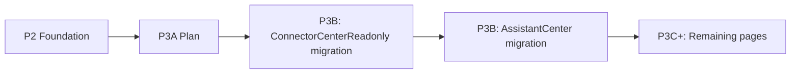

# AIP V7.51-P3 — Reference Page Migration Plan

- **Version:** AIP V7.51
- **Status:** Plan (Phase P3A — Selection & Sequencing)
- **Baseline HEAD:** 69da3b4
- **Preceding phases:** V7.51-P1 (layout fixes), V7.51-P2 (design system foundation components)

---

## 1. Goal

Migrate a limited set of existing pages to use the new design system foundation components (`PageShell`, `PageHeader`, `PageSubtitle`, `StatusStrip`, `SafetyBoundaryBar`, `SectionCard`, `EmptyState`, `StatusBadge`) without changing runtime behavior, exposing hidden previews, or enabling Stage C.

## 2. Candidate Pages

| Page | Lines | Uses WorkspaceGrid? | Dedicated CSS? | Already imports from ui barrel? | Risk Level |
|---|---|---|---|---|---|
| ConnectorCenterReadonly | 356 | No | No (all inline) | PageShell, SectionCard | **Low** |
| AssistantCenter | 397 | No | Yes | PageShell | **Low–Medium** |
| FactoryStatus | 688 | Yes | Yes | Many ui components | Medium |
| Dashboard | 686 | Yes | Yes | PageHeader only | **High** (excluded) |
| CostRouting | 2247 | No | Yes | EmptyState, SectionCard, StatusBadge | **High** (deferred) |
| PluginPool | 841 | Yes | No (only shared.css) | PageHeader, SectionCard, EmptyState | Medium (deferred for ErrorState) |

## 3. Selection Criteria

1. **Safety** — No WorkspaceGrid dependency (avoids layout cascade risk)
2. **Size** — Smaller pages are safer first targets
3. **Adoption readiness** — Already using some ui components
4. **CSS risk** — No dedicated CSS file means zero CSS regression
5. **Business logic coupling** — Low coupling means low migration risk

## 4. Recommended First Target: ConnectorCenterReadonly

**Rationale:**
- Smallest page (356 lines)
- No dedicated CSS — all styles use inline `style={{}}` props, so migration is purely JSX restructuring
- Already imports `PageShell` and `SectionCard`
- Purely readonly — no mutation, no side effects
- Inline `Badge` and `KpiCard` components are direct candidates for `StatusBadge` / `SectionCard` replacement
- No WorkspaceGrid dependency

**Migration scope for ConnectorCenterReadonly:**

| Current | Target |
|---|---|
| Custom inline `Badge(label, color)` | `StatusBadge` with tone mapping or simple `ui-tag` classes |
| Custom inline `KpiCard` | `SectionCard` with `meta` slot |
| Raw `
` connector cards | `SectionCard` with consistent header/body |
| `PageShell` (already used) | Already compatible — no change needed |
| Missing `StatusStrip` | Add summary strip above connector grid |
| `SafetyBoundaryBar` | Add if page has readonly/dry-run context |

## 5. Recommended Second Target: AssistantCenter

**Rationale:**
- Already uses `PageShell` (line 14)
- Inline `RiskBadge` and `StatusPill` components (lines 54–62) are direct replacements for `StatusBadge`
- Dedicated CSS file (`AssistantCenter.css`) — CSS migration is needed but bounded
- No WorkspaceGrid dependency
- Moderate size (397 lines)

**Migration scope for AssistantCenter:**

| Current | Target |
|---|---|
| Inline `RiskBadge` (line 54) | `StatusBadge` with color mapping |
| Inline `StatusPill` (line 59) | `StatusBadge` |
| Inline `CopyButton` (line 64) | Can remain inline — not in scope |
| Raw sections | `SectionCard` wrapping |
| Dedicated CSS | Migrate to shared.css tokens where possible |
| `PageShell` (already used) | Compatible |

## 6. Pages Deferred or Excluded

| Page | Reason | Target Phase |
|---|---|---|
| FactoryStatus | Uses WorkspaceGrid; layout migration risk | P3C or later |
| Dashboard | Excluded by P2 constraint; uses WorkspaceGrid + i18n | P3D or later |
| CostRouting | 2247 lines; chart-heavy; CSS risk is high | P3E or later |
| PluginPool | Has auth error state that needs ErrorState/AuthRequiredState components (not yet built) | P3F or later |

## 7. Migration Rules

1. **No runtime behavior change** — Data fetching, state management, and event handlers remain identical
2. **No hidden preview exposure** — Only components in the public barrel (`src/components/ui/index.ts`) may be used
3. **No sidebar expansion** — Sidebar navigation remains unchanged
4. **No Stage C enablement** — Migration is purely visual/structural
5. **No feature flag toggle** — No feature flags are touched
6. **No DB write** — No API calls are modified
7. **No restore** — No restore points are created or modified
8. **No tag/release** — No git tags or GitHub releases
9. **No restart/taskkill** — No service restarts

## 8. Execution Sequence

## 9. Acceptance Criteria

- ConnectorCenterReadonly renders identically before/after migration (visual diff)
- AssistantCenter renders identically before/after migration
- No TypeScript errors
- No build warnings beyond pre-existing chunk size warnings
- All existing page routes remain functional
- No new preview routes exposed
